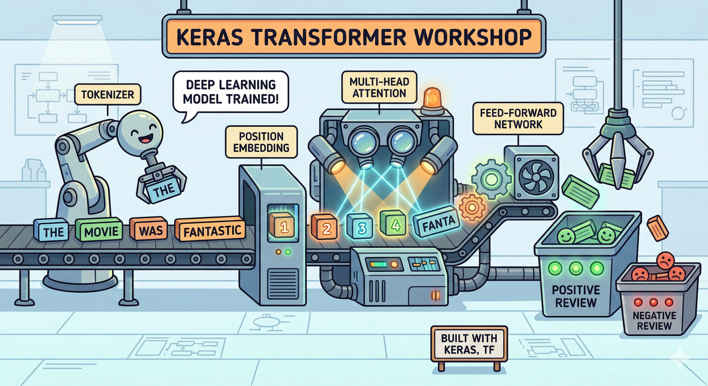
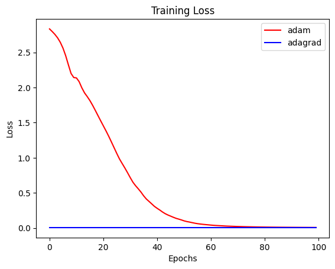
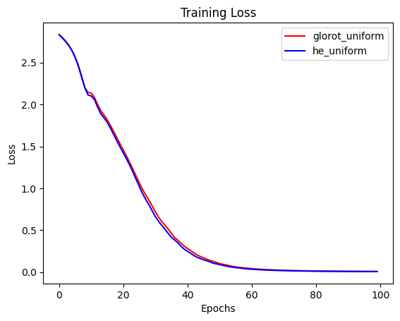
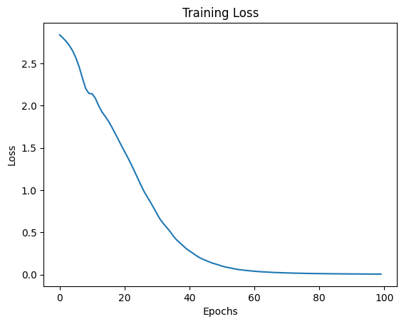

# Transformer-based Sequence-to-Sequence Model (Keras)



This project implements a simple **Transformer-style sequence-to-sequence model** using Keras, trained on a small English → Spanish dataset. The goal is to demonstrate how modern neural architectures learn to translate sequences by predicting the next token step-by-step.

---

## Project Overview

We construct a minimal pipeline for machine translation:

1. Prepare paired sentences (English → Spanish)
2. Add special tokens to guide decoding
3. Convert text into token sequences
4. Train a model to predict the next word
5. Evaluate training behavior using loss curves

The model learns by repeatedly answering the question:

> “Given what I have seen so far, what is the next word?”

---

## Data Preparation

We begin with a small collection of parallel sentences in two languages. Each English sentence is paired with its Spanish translation.

To help the decoder understand when to begin and end generation, we modify the target sentences by adding special tokens:

- `startseq` → indicates the beginning of a sequence  
- `endseq` → indicates the end of a sequence  

Example:

```

Hola → startseq Hola endseq

```

This allows the model to learn both **when to start generating** and **when to stop**.

---

## Training Strategy (Core Idea)

Instead of predicting the whole sentence at once, the model learns **one step at a time**.

For a target sentence:

```

startseq Hola amigo endseq

```

We split it into:

- **Input to decoder**:  
  `startseq Hola amigo`

- **Expected output**:  
  `Hola amigo endseq`

So the model learns:

- given `startseq` → predict `Hola`
- given `Hola` → predict `amigo`
- given `amigo` → predict `endseq`

This is called **teacher forcing**.

---

## Mathematical Formulation (Plain Text)

Let:

- V = vocabulary size  
- y_t = correct token at time t  
- p_t = predicted probability distribution at time t  

At each step, the model outputs a vector:

```

p_t = softmax(z_t)

```

where:

```

softmax(z_i) = exp(z_i) / sum_j exp(z_j)

```

The training objective is to minimize **cross-entropy loss**:

```

Loss = - sum_t log(p_t[y_t])

```

Meaning:

- the model is penalized if it assigns low probability to the correct next word

---

## One-Hot Encoding

Each correct output token is converted into a vector of size V:

Example (V = 5, token index = 2):

```

[0, 0, 1, 0, 0]

```

This allows comparison with the model’s predicted probability distribution.

---

## Model Components

- **Embedding Layer** → converts tokens to vectors  
- **Positional Encoding (PE)** → injects order information  
- **Self-Attention** → captures relationships between words  
- **Feed Forward Network** → transforms representations  
- **Softmax Output Layer** → produces probabilities over vocabulary  

---

## Training Results

### Optimizer Comparison



**Observation:**
- Adam converges faster and more smoothly
- Adagrad shows slower and less stable learning

**Conclusion:**
Adam is more suitable for this task due to adaptive learning and better convergence behavior.

---

### Weight Initialization Comparison



**Observation:**
- Both initializations perform similarly
- Slight differences appear early in training but vanish later

**Conclusion:**
For this task, initialization choice has limited impact compared to optimizer choice.

---

### Final Training Curve



**Observation:**
- Loss steadily decreases and stabilizes
- No major oscillations or divergence

**Conclusion:**
The model successfully learns the sequence prediction task and converges properly.

---

## Key Takeaways

- Sequence-to-sequence models learn by **predicting the next token**
- Special tokens (`startseq`, `endseq`) are critical for training
- The output layer always has size equal to **vocabulary size**
- Training uses **shifted sequences** (input vs expected output)
- Optimizer choice significantly affects convergence

---

## Future Improvements

- Use a larger dataset
- Add attention visualization
- Replace simple architecture with full Transformer blocks
- Evaluate with BLEU score
- Add inference (actual translation generation)

---

## File Structure

```

keras-transformers.ipynb   # main notebook
adam_adagrad.png          # optimizer comparison
glorot_he_uniform.png     # initialization comparison
training_loss.png         # training curve

```

---


* make it **more “impressive for recruiters”**
* or **more minimal / academic / Overleaf-style**
